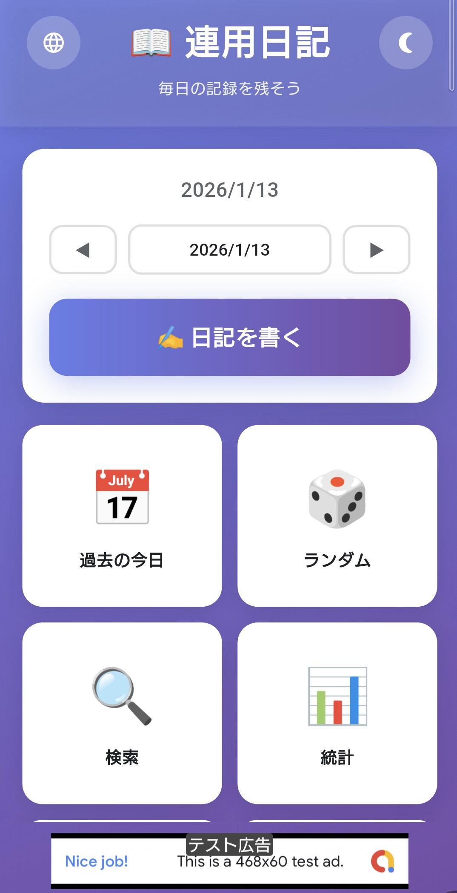
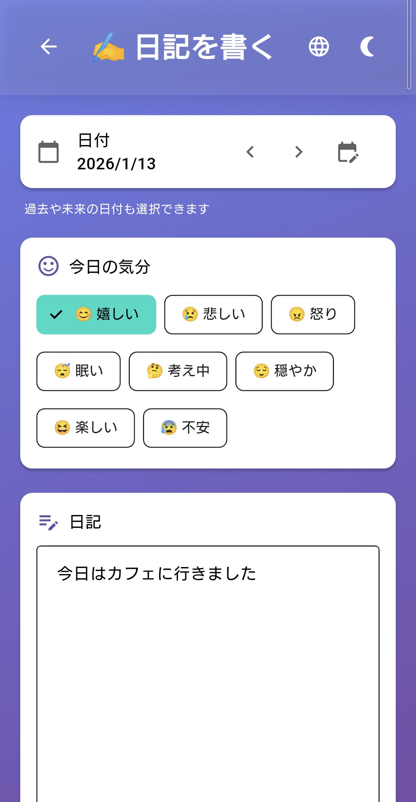

# Daily Diary - Flutter Mobile App

Cross-platform diary app built with Flutter, from concept to Google Play release.

(Flutter製クロスプラットフォーム日記アプリ - 企画からGoogle Playリリースまで)

## Screenshots

  
  
  

## Features

| Feature | Description |
|---------|-------------|
| **5 Language Support** | 🇯🇵 Japanese, 🇺🇸 English, 🇨🇳 Chinese, 🇰🇷 Korean, 🇪🇸 Spanish |
| **Dark Mode** | Full dark mode support with system preference detection |
| **Offline-First** | All data stored locally on device, no cloud dependency |
| **Calendar View** | Visual calendar with mood indicators and quick navigation |
| **Statistics** | Writing streaks, mood trends, and activity analysis |
| **Search** | Full-text search and tag-based filtering |
| **Random Entry** | Rediscover past entries randomly |
| **Data Export/Import** | JSON-based backup and restore |

## Tech Stack

| Category | Technologies |
|----------|--------------|
| **Framework** | Flutter 3.x, Dart |
| **State Management** | Provider |
| **Local Storage** | Hive (NoSQL) |
| **Monetization** | Google AdMob (Banner Ads) |
| **Localization** | Flutter intl (ARB files) |
| **Architecture** | Single-codebase cross-platform |

## Development Approach

This app was developed using **Claude Code** (AI-assisted development tool by Anthropic).

(このアプリは **Claude Code**（Anthropic社のAI支援開発ツール）を使用して開発しました)

### What Claude Code Helped With:
- UI/UX implementation with consistent design patterns
- Multi-language localization (5 languages, 100+ keys)
- Dark mode implementation across all screens
- Bug fixing and code quality improvements
- Google Play Store preparation

### What I Did:
- Product concept and feature planning
- Design decisions and user experience direction
- Testing on physical devices
- Google Play Console setup and submission
- Code review and quality assurance

> This project demonstrates effective collaboration between human creativity and AI assistance in modern app development.
>
> (このプロジェクトは、現代のアプリ開発における人間の創造性とAI支援の効果的なコラボレーションを示しています)

## Project Evolution

This is the mobile app version of my earlier web application:

| Version | Platform | Repository |
|---------|----------|------------|
| **Web App** | Google Apps Script | [gas-daily-diary](https://github.com/yasumorishima/gas-daily-diary) |
| **Mobile App** | Flutter (Android/iOS) | This repository |

The Flutter version adds offline capability, native performance, and multi-language support while maintaining the same user experience philosophy.

## Status

**Google Play:** Coming Soon (Currently in Closed Testing)

<!-- After release, uncomment and update:

-->

## Privacy

- All diary data is stored locally on your device only
- No cloud sync, no data collection
- [Privacy Policy](https://yasumorishima.github.io/diary-app-flutter-privacy/)

---

*Built with Flutter and Claude Code*
